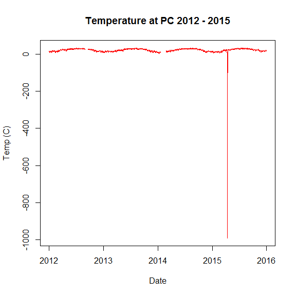
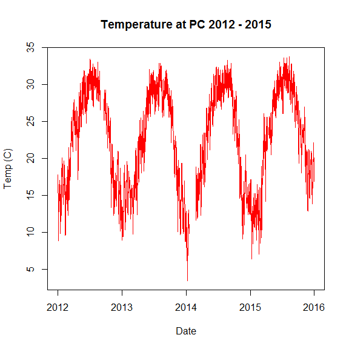

# SWMPr Workshop Part 2: Importing data and QAQC with SWMPr
Kim Cressman  
October 27, 2016; updated July 5, 2017  

<br>
Using `read.csv()` is all well and good if you're not dealing with a lot of data.

<br>
But with SWMP data, there's a lot to keep up with, and you could be using it for different projects. You don't want to have to keep multiple copies of the same data on your computer, right? You just want it in one place, and read it in from there. But this will probably be different from your working directory, where you want to save output.

<br>
__Enter the `import_local` function of SWMPr.__

<br>
First, open the SWMPr package:


```r
library(SWMPr)
```
<br>
You still want to set a working directory.


```r
setwd("C:/Users/kimberly.cressman/Desktop/NERRS SWMPr course 2016")
```
<br>

And now, you're going to give R a path to your data.

<br>
Again, you can name this anything you want, but you should pick something that makes sense.


```r
data.path <- "C:/Users/kimberly.cressman/Desktop/NERRS SWMPr course 2016" 
```

<br>

__Notice:__

*  The path is in quotation marks, just like when you're setting the working directory.
*  _Unlike_ setting the working directory, this does not go in parentheses.
*  Here, my data path is the same as my working directory, but that's just because of this training. In my real workflow, it's a different location.

<br>

If you only want to work with one file, your command would look like this:


```r
wqdat <- import_local(data.path, "gndpcwq2015")
```

<br>

__Notice:__

*  You don't have to include ".csv"
*  You _do_ have to use quotation marks around what you're looking for.
*  You still have to come up with a name for what you're reading in.

***

Check out your file; it should look pretty similar to what you read in earlier.


```r
head(wqdat)
```

```
##         datetimestamp temp f_temp spcond f_spcond  sal f_sal do_pct
## 1 2015-01-01 00:00:00 13.8    <0>  43.58      <0> 28.1   <0>  100.4
## 2 2015-01-01 00:15:00 13.6    <0>  43.31      <0> 27.9   <0>  100.2
## 3 2015-01-01 00:30:00 13.5    <0>  43.17      <0> 27.8   <0>   99.4
## 4 2015-01-01 00:45:00 13.2    <0>  42.93      <0> 27.6   <0>   99.4
## 5 2015-01-01 01:00:00 13.1    <0>  42.58      <0> 27.4   <0>   99.9
## 6 2015-01-01 01:15:00 13.2    <0>  42.45      <0> 27.3   <0>   99.4
##   f_do_pct do_mgl f_do_mgl depth f_depth cdepth f_cdepth level f_level
## 1      <0>    8.7      <0>  1.35     <0>   1.21      <3>    NA    <-1>
## 2      <0>    8.8      <0>  1.33     <0>   1.19      <3>    NA    <-1>
## 3      <0>    8.7      <0>  1.32     <0>   1.18      <3>    NA    <-1>
## 4      <0>    8.8      <0>  1.29     <0>   1.15      <3>    NA    <-1>
## 5      <0>    8.8      <0>  1.27     <0>   1.13      <3>    NA    <-1>
## 6      <0>    8.8      <0>  1.26     <0>   1.12      <3>    NA    <-1>
##   clevel f_clevel  ph f_ph turb f_turb chlfluor f_chlfluor
## 1     NA     <NA> 8.2  <0>    5    <0>       NA       <-1>
## 2     NA     <NA> 8.2  <0>    5    <0>       NA       <-1>
## 3     NA     <NA> 8.2  <0>    5    <0>       NA       <-1>
## 4     NA     <NA> 8.2  <0>    4    <0>       NA       <-1>
## 5     NA     <NA> 8.2  <0>    4    <0>       NA       <-1>
## 6     NA     <NA> 8.2  <0>    5    <0>       NA       <-1>
```

```r
tail(wqdat)
```

```
##             datetimestamp temp f_temp spcond f_spcond  sal f_sal do_pct
## 35035 2015-12-31 22:30:00 18.3    <0>  38.83      <0> 24.8   <0>   48.7
## 35036 2015-12-31 22:45:00 18.4    <0>  39.39      <0> 25.2   <0>   47.6
## 35037 2015-12-31 23:00:00 18.4    <0>  39.68      <0> 25.4   <0>   46.4
## 35038 2015-12-31 23:15:00 18.4    <0>  39.81      <0> 25.5   <0>   45.5
## 35039 2015-12-31 23:30:00 18.4    <0>  39.95      <0> 25.6   <0>   45.0
## 35040 2015-12-31 23:45:00 18.4    <0>  40.09      <0> 25.7   <0>   44.4
##       f_do_pct do_mgl f_do_mgl depth f_depth cdepth f_cdepth level f_level
## 35035      <0>    4.0      <0>  1.45     <0>   1.36      <3>    NA    <-1>
## 35036      <0>    3.9      <0>  1.45     <0>   1.35      <3>    NA    <-1>
## 35037      <0>    3.7      <0>  1.46     <0>   1.37      <3>    NA    <-1>
## 35038      <0>    3.7      <0>  1.44     <0>   1.35      <3>    NA    <-1>
## 35039      <0>    3.6      <0>  1.44     <0>   1.35      <3>    NA    <-1>
## 35040      <0>    3.6      <0>  1.44     <0>   1.35      <3>    NA    <-1>
##       clevel f_clevel  ph f_ph turb f_turb chlfluor f_chlfluor
## 35035     NA     <NA> 7.7  <0>    5    <0>       NA       <-1>
## 35036     NA     <NA> 7.7  <0>    5    <0>       NA       <-1>
## 35037     NA     <NA> 7.7  <0>    6    <0>       NA       <-1>
## 35038     NA     <NA> 7.7  <0>    6    <0>       NA       <-1>
## 35039     NA     <NA> 7.7  <0>    6    <0>       NA       <-1>
## 35040     NA     <NA> 7.7  <0>    6    <0>       NA       <-1>
```

```r
summary(wqdat)
```

```
##  datetimestamp                      temp           f_temp         
##  Min.   :2015-01-01 00:00:00   Min.   :-991.5   Length:35040      
##  1st Qu.:2015-04-02 05:56:15   1st Qu.:  17.1   Class :character  
##  Median :2015-07-02 11:52:30   Median :  23.6   Mode  :character  
##  Mean   :2015-07-02 11:52:30   Mean   :  20.8                     
##  3rd Qu.:2015-10-01 17:48:45   3rd Qu.:  28.8                     
##  Max.   :2015-12-31 23:45:00   Max.   :  33.8                     
##                                NA's   :5                          
##      spcond          f_spcond              sal            f_sal          
##  Min.   :-676.00   Length:35040       Min.   :-99.00   Length:35040      
##  1st Qu.:  28.34   Class :character   1st Qu.: 17.20   Class :character  
##  Median :  38.76   Mode  :character   Median : 24.60   Mode  :character  
##  Mean   :  43.64                      Mean   : 25.74                     
##  3rd Qu.:  43.67                      3rd Qu.: 28.00                     
##  Max.   :8384.84                      Max.   :999.90                     
##  NA's   :5                            NA's   :5                          
##      do_pct         f_do_pct             do_mgl          f_do_mgl        
##  Min.   :  4.20   Length:35040       Min.   :  0.300   Length:35040      
##  1st Qu.: 87.50   Class :character   1st Qu.:  6.200   Class :character  
##  Median : 95.90   Mode  :character   Median :  7.200   Mode  :character  
##  Mean   : 94.73                      Mean   :  7.825                     
##  3rd Qu.:103.40                      3rd Qu.:  8.500                     
##  Max.   :313.80                      Max.   :159.100                     
##  NA's   :5                           NA's   :5                           
##      depth         f_depth              cdepth       f_cdepth        
##  Min.   :0.000   Length:35040       Min.   :0.70   Length:35040      
##  1st Qu.:1.270   Class :character   1st Qu.:1.22   Class :character  
##  Median :1.390   Mode  :character   Median :1.35   Mode  :character  
##  Mean   :1.397                      Mean   :1.35                     
##  3rd Qu.:1.520                      3rd Qu.:1.48                     
##  Max.   :2.140                      Max.   :2.20                     
##  NA's   :5                          NA's   :946                      
##      level         f_level              clevel        f_clevel        
##  Min.   : NA     Length:35040       Min.   : NA     Length:35040      
##  1st Qu.: NA     Class :character   1st Qu.: NA     Class :character  
##  Median : NA     Mode  :character   Median : NA     Mode  :character  
##  Mean   :NaN                        Mean   :NaN                       
##  3rd Qu.: NA                        3rd Qu.: NA                       
##  Max.   : NA                        Max.   : NA                       
##  NA's   :35040                      NA's   :35040                     
##        ph            f_ph                turb            f_turb         
##  Min.   :6.400   Length:35040       Min.   :   -5.0   Length:35040      
##  1st Qu.:7.900   Class :character   1st Qu.:    8.0   Class :character  
##  Median :8.000   Mode  :character   Median :   21.0   Mode  :character  
##  Mean   :7.972                      Mean   :  124.9                     
##  3rd Qu.:8.100                      3rd Qu.:   58.0                     
##  Max.   :8.600                      Max.   :26790.0                     
##  NA's   :5                          NA's   :5                           
##     chlfluor      f_chlfluor       
##  Min.   : NA     Length:35040      
##  1st Qu.: NA     Class :character  
##  Median : NA     Mode  :character  
##  Mean   :NaN                       
##  3rd Qu.: NA                       
##  Max.   : NA                       
##  NA's   :35040
```

```r
str(wqdat)
```

```
## Classes 'swmpr' and 'data.frame':	35040 obs. of  25 variables:
##  $ datetimestamp: POSIXct, format: "2015-01-01 00:00:00" "2015-01-01 00:15:00" ...
##  $ temp         : num  13.8 13.6 13.5 13.2 13.1 13.2 13.1 13.1 13.1 13 ...
##  $ f_temp       : chr  "<0>" "<0>" "<0>" "<0>" ...
##  $ spcond       : num  43.6 43.3 43.2 42.9 42.6 ...
##  $ f_spcond     : chr  "<0>" "<0>" "<0>" "<0>" ...
##  $ sal          : num  28.1 27.9 27.8 27.6 27.4 27.3 27 26.9 26.9 26.6 ...
##  $ f_sal        : chr  "<0>" "<0>" "<0>" "<0>" ...
##  $ do_pct       : num  100.4 100.2 99.4 99.4 99.9 ...
##  $ f_do_pct     : chr  "<0>" "<0>" "<0>" "<0>" ...
##  $ do_mgl       : num  8.7 8.8 8.7 8.8 8.8 8.8 8.8 8.9 8.7 8.8 ...
##  $ f_do_mgl     : chr  "<0>" "<0>" "<0>" "<0>" ...
##  $ depth        : num  1.35 1.33 1.32 1.29 1.27 1.26 1.23 1.21 1.2 1.19 ...
##  $ f_depth      : chr  "<0>" "<0>" "<0>" "<0>" ...
##  $ cdepth       : num  1.21 1.19 1.18 1.15 1.13 1.12 1.09 1.07 1.06 1.06 ...
##  $ f_cdepth     : chr  "<3>" "<3>" "<3>" "<3>" ...
##  $ level        : num  NA NA NA NA NA NA NA NA NA NA ...
##  $ f_level      : chr  "<-1>" "<-1>" "<-1>" "<-1>" ...
##  $ clevel       : num  NA NA NA NA NA NA NA NA NA NA ...
##  $ f_clevel     : chr  NA NA NA NA ...
##  $ ph           : num  8.2 8.2 8.2 8.2 8.2 8.2 8.2 8.2 8.2 8.1 ...
##  $ f_ph         : chr  "<0>" "<0>" "<0>" "<0>" ...
##  $ turb         : num  5 5 5 4 4 5 5 5 5 5 ...
##  $ f_turb       : chr  "<0>" "<0>" "<0>" "<0>" ...
##  $ chlfluor     : num  NA NA NA NA NA NA NA NA NA NA ...
##  $ f_chlfluor   : chr  "<-1>" "<-1>" "<-1>" "<-1>" ...
##  - attr(*, "station")= chr "gndpcwq"
##  - attr(*, "parameters")= chr  "temp" "spcond" "sal" "do_pct" ...
##  - attr(*, "qaqc_cols")= logi TRUE
##  - attr(*, "cens_cols")= logi FALSE
##  - attr(*, "date_rng")= POSIXct, format: "2015-01-01 00:00:00" "2015-12-31 23:45:00"
##  - attr(*, "timezone")= chr "America/Regina"
##  - attr(*, "stamp_class")= chr  "POSIXct" "POSIXt"
```

<br>

__There are a few differences though:__

*  capitalization has changed - SWMPr has made all of the column names entirely lower case.
*  datetimestamp is already in the proper format (`POSIXct`)
*  There are some attributes at the bottom. This is a form of metadata.

***

<br>
__Now, let's read in multiple files.__ 

Let's read in everything in that folder for `gndpcwq`. I'm adding in `trace=TRUE` so I can see the progress.


```r
wqdat <- import_local(data.path, "gndpcwq", trace=TRUE)
```

```
## Loading files...
## 
## gndpcwq2012.csv 	gndpcwq2013.csv 	gndpcwq2014.csv 	gndpcwq2015.csv 	
## 
## Data imported...
```

<br>

Again, check out the file - there's a lot more data!


```r
summary(wqdat)
```

```
##  datetimestamp                      temp            f_temp         
##  Min.   :2012-01-01 00:00:00   Min.   :-991.50   Length:140256     
##  1st Qu.:2012-12-31 05:56:15   1st Qu.:  16.80   Class :character  
##  Median :2013-12-31 11:52:30   Median :  23.50   Mode  :character  
##  Mean   :2013-12-31 11:52:30   Mean   :  22.04                     
##  3rd Qu.:2014-12-31 17:48:45   3rd Qu.:  28.60                     
##  Max.   :2015-12-31 23:45:00   Max.   :  33.80                     
##                                NA's   :5587                        
##      spcond          f_spcond              sal            f_sal          
##  Min.   :-676.00   Length:140256      Min.   :-99.00   Length:140256     
##  1st Qu.:  26.23   Class :character   1st Qu.: 15.90   Class :character  
##  Median :  36.12   Mode  :character   Median : 22.70   Mode  :character  
##  Mean   :  36.55                      Mean   : 21.89                     
##  3rd Qu.:  41.94                      3rd Qu.: 26.80                     
##  Max.   :8384.84                      Max.   :999.90                     
##  NA's   :5587                         NA's   :5587                       
##      do_pct         f_do_pct             do_mgl          f_do_mgl        
##  Min.   :-50.00   Length:140256      Min.   : -4.100   Length:140256     
##  1st Qu.: 84.60   Class :character   1st Qu.:  6.000   Class :character  
##  Median : 95.10   Mode  :character   Median :  7.200   Mode  :character  
##  Mean   : 89.12                      Mean   :  7.111                     
##  3rd Qu.:103.30                      3rd Qu.:  8.500                     
##  Max.   :367.00                      Max.   :159.100                     
##  NA's   :5587                        NA's   :5587                        
##      depth         f_depth              cdepth        f_cdepth        
##  Min.   :0.000   Length:140256      Min.   :0.200   Length:140256     
##  1st Qu.:1.140   Class :character   1st Qu.:1.100   Class :character  
##  Median :1.320   Mode  :character   Median :1.280   Mode  :character  
##  Mean   :1.296                      Mean   :1.257                     
##  3rd Qu.:1.470                      3rd Qu.:1.440                     
##  Max.   :2.780                      Max.   :2.890                     
##  NA's   :5587                       NA's   :21410                     
##      level          f_level              clevel         f_clevel        
##  Min.   : NA      Length:140256      Min.   : NA      Length:140256     
##  1st Qu.: NA      Class :character   1st Qu.: NA      Class :character  
##  Median : NA      Mode  :character   Median : NA      Mode  :character  
##  Mean   :NaN                         Mean   :NaN                        
##  3rd Qu.: NA                         3rd Qu.: NA                        
##  Max.   : NA                         Max.   : NA                        
##  NA's   :140256                      NA's   :140256                     
##        ph           f_ph                turb             f_turb         
##  Min.   :5.60   Length:140256      Min.   :   -5.00   Length:140256     
##  1st Qu.:7.80   Class :character   1st Qu.:    7.00   Class :character  
##  Median :8.00   Mode  :character   Median :   17.00   Mode  :character  
##  Mean   :7.92                      Mean   :   87.77                     
##  3rd Qu.:8.10                      3rd Qu.:   39.00                     
##  Max.   :8.80                      Max.   :26790.00                     
##  NA's   :5587                      NA's   :5587                         
##     chlfluor       f_chlfluor       
##  Min.   : NA      Length:140256     
##  1st Qu.: NA      Class :character  
##  Median : NA      Mode  :character  
##  Mean   :NaN                        
##  3rd Qu.: NA                        
##  Max.   : NA                        
##  NA's   :140256
```

***

<br>
__How do we find out the specific qc codes in this file?__


```r
qctable <- qaqcchk(wqdat)
print.data.frame(qctable)
```

```
##                flag f_cdepth f_chlfluor f_depth f_do_mgl f_do_pct f_level
## 1                       2722          0       0        0        0       0
## 2              <-1>        0     140256       0        0        0  140256
## 3        <-2> [GCM]     4354          0       0        0        0       0
## 4        <-2> [GIM]        0          0    3647     3647     3647       0
## 5        <-2> [GMC]        0          0      22       22       22       0
## 6        <-2> [GPF]        0          0    1916     1916     1916       0
## 7  <-2> [GSM] (CMC)        0          0       2        2        2       0
## 8        <-3> (CBF)        0          0       0     5179     5179       0
## 9        <-3> (CMC)        0          0       4        4        4       0
## 10       <-3> (CMD)        0          0       0       42       42       0
## 11       <-3> (CSM)        0          0       0        0        0       0
## 12       <-3> [GCR]    14334          0       0        0        0       0
## 13 <-3> [GMC] (CND)        0          0       1        1        1       0
## 14 <-3> [GMC] (CSM)        0          0       1        1        1       0
## 15 <-3> [GQR] (CND)        0          0       0        1        1       0
## 16 <-3> [GSM] (CBF)        0          0       0        1        1       0
## 17 <-3> [GSM] (CMC)        0          0       6        5        5       0
## 18 <-3> [GSM] (CWE)        0          0       0        0        0       0
## 19       <-3> [SCF]        0          0   11791    12814        0       0
## 20 <-3> [SCF] (CAB)        0          0       0      134        0       0
## 21 <-3> [SCF] (CDA)        0          0       0       11        0       0
## 22 <-3> [SCF] (CSM)        0          0     187      187        0       0
## 23 <-3> [SCF] (CWD)        0          0    1601        0        0       0
## 24 <-3> [SDP] (CBF)        0          0       0     2414     2414       0
## 25 <-3> [SOW] (CMC)        0          0       1        1        1       0
## 26       <-3> [SPC]        0          0       0        0        0       0
## 27 <-3> [SPC] (CBF)        0          0       0     4009     4009       0
## 28       <-3> [SQR]        0          0       0        0        0       0
## 29 <-3> [SSD] (CBF)        0          0       0        0        0       0
## 30       <-3> [SSM]        0          0       0        0        0       0
## 31 <-3> [SSM] (CBF)        0          0       0        0        0       0
## 32 <-3> [SSM] (CSM)        0          0       0        0        0       0
## 33       <-3> [STF]        0          0     724      724      724       0
## 34       <-3> [STS]        0          0       0        0        0       0
## 35 <-3> [STS] (CBF)        0          0       0        0        0       0
## 36 <-3> [STS] (CCU)        0          0       0        0        0       0
## 37 <-3> [STS] (CWD)        0          0       0        0        0       0
## 38 <-3> [SWM] (CBF)        0          0       0      625      625       0
## 39              <0>        0          0  107823   100921   112033       0
## 40        <0> (CAB)        0          0       0      152      152       0
## 41        <0> (CDA)        0          0       0      591      602       0
## 42        <0> (CDF)        0          0       9        0        0       0
## 43        <0> (CND)        0          0      47       49       52       0
## 44        <0> (CRE)        0          0     372      372      372       0
## 45        <0> (CSM)        0          0       0        0        0       0
## 46        <0> (CTS)        0          0       0        0        0       0
## 47        <0> (CWD)        0          0       0     5655     7256       0
## 48        <0> (CWE)        0          0     135      135      135       0
## 49  <0> [GSM] (CAB)        0          0       0      453      587       0
## 50  <0> [GSM] (CDF)        0          0       2        2        2       0
## 51  <0> [GSM] (CND)        0          0       1        1        1       0
## 52        <1> (CAF)        0          0       0        0        0       0
## 53        <1> (CBF)        0          0       0        0        0       0
## 54        <1> (CCU)        0          0       0       26       26       0
## 55        <1> (CSM)        0          0       0        0        0       0
## 56        <1> (CWD)        0          0    7097        0        0       0
## 57        <1> [GCS]     9755          0       0        0        0       0
## 58  <1> [GSM] (CWE)        0          0       0        0        0       0
## 59  <1> [SCF] (CBF)        0          0    1832        0        0       0
## 60  <1> [SDO] (CCU)        0          0       0        2        2       0
## 61        <1> [SPC]        0          0     817      102      102       0
## 62  <1> [SPC] (CBF)        0          0       0        0        0       0
## 63  <1> [SPC] (CSM)        0          0       0        0        0       0
## 64        <1> [SSD]        0          0       0       55       55       0
## 65  <1> [SSD] (CBF)        0          0       0        0      285       0
## 66  <1> [SSM] (CSM)        0          0       0        0        0       0
## 67        <1> [STS]        0          0       0        0        0       0
## 68  <1> [STS] (CWD)        0          0       0        0        0       0
## 69              <3>   106873          0       0        0        0       0
## 70        <3> [GCC]     2218          0       0        0        0       0
## 71  <5> [SIC] (CSM)        0          0    2218        0        0       0
##      f_ph  f_sal f_spcond f_temp f_turb
## 1       0      0        0      0      0
## 2       0      0        0      0      0
## 3       0      0        0      0      0
## 4    3647   3647     3647   3647   3647
## 5      22     22       22     22     22
## 6    1916   1916     1916   1916   1916
## 7       2      2        2      2      2
## 8     516    419      419      0   5379
## 9       4      4        4      4      4
## 10      0      0        0      0    573
## 11      3      0        0      0      0
## 12      0      0        0      0      0
## 13      1      1        1      1      1
## 14      1      1        1      1      1
## 15      1      0        0      0      0
## 16      0      0        0      0      0
## 17      6      6        6      6      6
## 18      0      0        0      0    411
## 19      0   1086        0      0      0
## 20      0      0        0      0      0
## 21      0      0        0      0      0
## 22      0      0        0      0      0
## 23      0      0        0      0      0
## 24      0      0        0      0      0
## 25      1      1        1      1      1
## 26      0   1832     1832      0      0
## 27   3584   7907     8993      0    772
## 28      0      0        0      0     22
## 29      0    371      371      0      0
## 30   1607    183      183      0      0
## 31    391      0        0      0      0
## 32   4883   3613     3613      0      0
## 33    724    724      724    724    724
## 34      0      0        0      0    325
## 35      0      0        0      0     33
## 36      0      0        0      0      3
## 37      0      0        0      0      9
## 38      0      0        0      0   1223
## 39 107297 101515   101515 124675 103302
## 40    152      0        0      0      0
## 41      0      0        0      0      0
## 42      0      0        0      0    810
## 43     50     49       49     51     49
## 44    953    372      372    372    427
## 45      0   1049     1049      0      0
## 46      0      0        0      0     41
## 47   7991   7095     7095   8696   8621
## 48    135    135      135    135    135
## 49    194      0        0      0      0
## 50      2      2        2      2      2
## 51      1      1        1      1      1
## 52      0      0        0      0    102
## 53   3520   1538     1538      0      0
## 54      6      0        0      0     18
## 55      0   1949     1949      0      0
## 56      0      0        0      0      0
## 57      0      0        0      0      0
## 58      0      0        0      0  11111
## 59      0      0        0      0      0
## 60      0      0        0      0      0
## 61      0    749      749      0      0
## 62   2646   2665     2665      0    339
## 63      0    509      509      0      0
## 64      0    644      644      0      0
## 65      0    104      104      0      0
## 66      0    145      145      0      0
## 67      0      0        0      0    213
## 68      0      0        0      0     11
## 69      0      0        0      0      0
## 70      0      0        0      0      0
## 71      0      0        0      0      0
```

<br>
That was for everything. If we only want to see what's relevant to temp, we can try this:


```r
unique(wqdat$f_temp)
```

```
##  [1] "<0>"              "<-2> [GMC]"       "<0> (CND)"       
##  [4] "<-3> [SOW] (CMC)" "<0> (CRE)"        "<-3> (CMC)"      
##  [7] "<0> (CWD)"        "<0> (CWE)"        "<-2> [GPF]"      
## [10] "<-3> [GMC] (CSM)" "<-2> [GSM] (CMC)" "<-3> [GSM] (CMC)"
## [13] "<0> [GSM] (CND)"  "<-2> [GIM]"       "<0> [GSM] (CDF)" 
## [16] "<-3> [STF]"       "<-3> [GMC] (CND)"
```


<br>
Most of the time, you're going to want to get rid of data that has rejected (-3) and suspect (1) flags associated with it, and only keep 0 (and maybe 5, which indicates corrected data) flags. Not always though, and there is a way to keep what you want.

***

<br>
Let's do a plot of temperature again, so we can see our starting point. We'll do a before and after comparison to see what the `qaqc` command can do for us.


```r
summary(wqdat$temp)
```

```
##    Min. 1st Qu.  Median    Mean 3rd Qu.    Max.    NA's 
## -991.50   16.80   23.50   22.04   28.60   33.80    5587
```

```r
plot(temp ~ datetimestamp, data = wqdat,
     type = "l",
     col = "red",
     main = "Temperature at PC 2012 - 2015",
     xlab = "Date",
     ylab = "Temp (C)")
```

<!-- -->

***

<br>
Now, let's only keep data flagged with a 0. We'll put this into a new data frame called wqdat2.


```r
wqdat2 <- qaqc(wqdat, qaqc_keep = 0)
summary(wqdat2)
```

```
##  datetimestamp                      temp           spcond     
##  Min.   :2012-01-01 00:00:00   Min.   : 3.50   Min.   : 7.67  
##  1st Qu.:2012-12-31 05:56:15   1st Qu.:16.80   1st Qu.:29.18  
##  Median :2013-12-31 11:52:30   Median :23.50   Median :37.24  
##  Mean   :2013-12-31 11:52:30   Mean   :22.58   Mean   :35.32  
##  3rd Qu.:2014-12-31 17:48:45   3rd Qu.:28.70   3rd Qu.:42.27  
##  Max.   :2015-12-31 23:45:00   Max.   :33.80   Max.   :50.62  
##                                NA's   :6324    NA's   :30038  
##       sal            do_pct           do_mgl          depth      
##  Min.   : 4.30   Min.   :  8.40   Min.   : 0.60   Min.   :0.54   
##  1st Qu.:18.00   1st Qu.: 88.20   1st Qu.: 6.30   1st Qu.:1.19   
##  Median :23.50   Median : 96.40   Median : 7.40   Median :1.34   
##  Mean   :22.32   Mean   : 95.25   Mean   : 7.39   Mean   :1.33   
##  3rd Qu.:27.10   3rd Qu.:104.00   3rd Qu.: 8.50   3rd Qu.:1.48   
##  Max.   :33.20   Max.   :185.70   Max.   :15.80   Max.   :2.78   
##  NA's   :30038   NA's   :19064    NA's   :31925   NA's   :31867  
##      cdepth           level            clevel             ph       
##  Min.   : NA      Min.   : NA      Min.   : NA      Min.   :7.000  
##  1st Qu.: NA      1st Qu.: NA      1st Qu.: NA      1st Qu.:7.900  
##  Median : NA      Median : NA      Median : NA      Median :8.000  
##  Mean   :NaN      Mean   :NaN      Mean   :NaN      Mean   :8.016  
##  3rd Qu.: NA      3rd Qu.: NA      3rd Qu.: NA      3rd Qu.:8.100  
##  Max.   : NA      Max.   : NA      Max.   : NA      Max.   :8.800  
##  NA's   :140256   NA's   :140256   NA's   :140256   NA's   :23481  
##       turb            chlfluor     
##  Min.   :   0.00   Min.   : NA     
##  1st Qu.:   6.00   1st Qu.: NA     
##  Median :  14.00   Median : NA     
##  Mean   :  21.75   Mean   :NaN     
##  3rd Qu.:  25.00   3rd Qu.: NA     
##  Max.   :2161.00   Max.   : NA     
##  NA's   :26868     NA's   :140256
```

<br>

__Notice, the qc columns went away - SWMPr automatically removes them.__  This makes the data frame considerably smaller (look in the 'Environment' tab in the top right corner of RStudio to see the difference in size between wqdat and wqdat2). 

<br>
The crazy temperature readings went away too, as you can see in the summary and in a new plot:


```r
plot(temp ~ datetimestamp, data = wqdat2,
     type = "l",
     col = "red",
     main = "Temperature at PC 2012 - 2015",
     xlab = "Date",
     ylab = "Temp (C)")
```

<!-- -->

<br>

__Sometimes you want to keep suspect flags too (1), or corrected data (5).__ 

The DMC and CDMO have fairly strict guidelines on what needs to get flagged. They want to make sure to call attention to any potentially problematic data and let the user decide what to keep or get rid of - so there may be things that are flagged that you want to keep.

*  Look at what the qaqcchk() command generates to see what QC codes are in your file.
*  Look in the metadata to see what those codes mean. Some of them are less severe than others. For example, you might not mind keeping:
    +  <1> [SDG] - sensor diagnostics
    +  <1> (CWD) - collected at wrong depth
    +  <-3> [SCF] for depth - rejected due to conductivity sensor failure (otherwise it would be pretty rare to keep rejected data)
    +  <-4> - nutrient value below detection
    +  <5> - corrected data
*  Talk to your SWMP tech and get their thoughts on common data issues and what they see as more or less serious.

<br>
__Note: Before 2008, QC was done differently.__ There was no equivalent _within the data file_ to a <1>/suspect flag - data was either kept or deleted, and any notes about being suspect were included in the metadata documents. If you're trying to do strong long-term analyses, you will need to deal with those differences somehow.

***

<br>
__Back to keeping more than just 0 flags.__

Here's how you do it:


```r
wqdat2 <- qaqc(wqdat, qaqc_keep = c(0,1,5))
```

<br>

This doesn't change our temperature data because we didn't have any 1 or 5 flags in the first place (but it will affect some of the other parameters).

***

<br>
You can also choose to keep specific letter codes. We'll practice with the catastrophic temperature probe failure because it's easy to see if what we're doing works.


```r
wqdat2 <- qaqc(wqdat, qaqc_keep = c(0, 'STF'))
summary(wqdat2$temp)
```

```
##    Min. 1st Qu.  Median    Mean 3rd Qu.    Max.    NA's 
## -991.50   16.80   23.50   22.42   28.60   33.80    6028
```

<br>

SWMPr is doing something called "partial character matching" - you put in a piece of the QC code that you want to keep, and SWMPr finds anything that contains that piece.

<br>
__There will be times that you want to be more specific__ than keeping all <1>s, but you can't narrow it down to just the character code. For example, you might have a file with all of these flags:


*  <1> [SPC]  -- suspect, failed post-cal
*  <1> [CBF]  -- suspect, affected by biofouling
*  <-3> [SPC]  -- rejected, failed post-cal
*  <-3> [CBF]  -- rejected, affected by biofouling

<br>

You might want to see if keeping the <1> [CBF] data makes a difference in your analysis. You don't want to keep all <1>s, and you don't want to keep all [CBF]s. You want to be specific.

<br>
We don't actually have those codes here, so we're going to stick with the example of <-3> [STF] (that bad data due to temperature probe failure; reading as low as -991.5 degrees C).

<br>
You might think the way to do this is:


```r
wqdat2 <- qaqc(wqdat, qaqc_keep = c(0, '<-3> [STF]'))
```

<br>

But from the summary, we see that didn't work - it only kept good data.


```r
summary(wqdat2$temp)
```

```
##    Min. 1st Qu.  Median    Mean 3rd Qu.    Max.    NA's 
##    3.50   16.80   23.50   22.58   28.70   33.80    6324
```

<br>

Remember how we keep talking about quotation marks and capitalization being important? R is _very_ picky about syntax.

<br>
Brackets `[]` have a specific meaning when they're used in character matching, and that's not the meaning we're going for here. So we have to use two backslashes in front of each bracket, like this:


```r
wqdat2 <- qaqc(wqdat, qaqc_keep = c(0, '<-3> \\[STF\\]'))
```

<br>

And look! We retained the data with that code:


```r
summary(wqdat2$temp)
```

```
##    Min. 1st Qu.  Median    Mean 3rd Qu.    Max.    NA's 
## -991.50   16.80   23.50   22.42   28.60   33.80    6028
```

***

<br>
Don't worry about that too much - __the vast majority of the time, you're just going to be doing something easy__ like we did above, and keeping certain numeric codes.


```r
wqdat2 <- qaqc(wqdat, qaqc_keep = c(0,1,5))
```

<br>

Let's look at this plot again.


```r
plot(temp ~ datetimestamp, data = wqdat2,
     type = "l",
     col = "red",
     main = "Temperature at PC 2012 - 2015",
     xlab = "Date",
     ylab = "Temp (C)")
```

<!-- -->

***
<br>

Readings every 15 minutes can make for a noisy graph. You have daily variations, tidal variations, seasonal variations, and annual variations. 

<br>
SWMPr can help us with all of this too! 

<br>
So now, Kari will talk about aggregating data into more manageable chunks.

<br>
<br>
.
